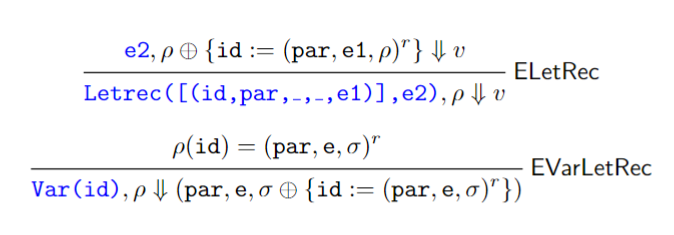

- mostly-weekly quizzes on wednesdays
  - one lowest quiz grade dropped
- one-page cheat sheet for mid/endterms

# OCaml
- if we run in the utop interpreter:
  ```
  utop # 1;;
  - : int = 1
  ```
  - hyphen (-): this variable has no name
  - type (int)
  - value (1)

## types, operations
- think like a business major, they use this language for trading
- float operations look like `+.`
- concatenation: `"hello" ^ "bye = "hellobye""`
- inequality conditional: `1 <> 1` = true
- equality conditional: `"h" = "h"` = true
- deep equality conditional: `"h" = "h"` = false
  - they are not the exact same object so it doesn't count
- inline if/then: `if x then y else z`
  - x must be a conditional; can't be cute and use 1 = true
  - y and z must be the same type
- top-level declaration: `let x = 1`
- local-scope declaration: `let x = 7 in x + x` 
  - i.e. x only =7 for that bit of code, then it returns to its global value or vanishes afterward
  - you can do this in c by just putting brackets to declare a local scope
- int, string, char, bool are *scalar* types
## functions
- functions are defined in modules, like Java packages/classes
  ```ocaml
  String.length "hello";;
  - : int = 5
  ```
  - "fully qualified name" = calling something with a bunch of dots
    ```ocaml
    Char.uppercase_ascii 'a';;
    A
    ```
- defining a function: `let f i = i+1`
  - f = name of function
  - i = formal parameter
  - i+1 = body
  - works like f(i) = i+1
  - utop tells us `val f : int -> int = <fun>`
    - i.e. f is a function that takes a parameter int and returns an int
- call a function: `f 2` returns 3
  - like f(2)
- if you do `f f 2`
  - ocaml reads f(f)(2)
  - which is not how we wrote f, and we probably won't
  - just write f (f 2)
- we will use built-in functions instead of constantly redefining them
- identity function: one that boils down to `let f i = i` which always returns its input
- constant function: one that boils down to `let f i = 3` which always returns the same value
- function of two arguments: `let f x y = x + y` ≡ `f(x, y) = x+y`
  - utop tells us `val f : int -> int -> int = <fun>`
  - which means int -> (int -> int) 
    - like how we know 8/4/2 = (8/4)/2 and nothing else
  - this means that f is a function that, given a number, returns a function that, given a number, returns a function
  - you can't give more arguments but you can give less and get a function back


## lists
- lists: `[1;2;3]`
  - head: `list.hd [1;2;3]` = 1
  - tail: `list.tl [1;2;3]` = 3
  - doing either on an empty list throws an exception
- order is specific
  - `[1;2;3] == [3;2;1]` returns false 
- the empty list is an arbitrary type; you can concatenate it to anything and vice versa
- list concatenation: `[1;2] @ [3;4]` = `[1;2;3;4]`
- if we have a function `let f i = 7;;`, what type is `i`?
  - if it's never used, then it can be any type
  - ocaml decides `val f : 'a -> int = <fun>`
  - that `a` is a type variable
- if we have a `let f i = i;;`, what type is `i` and what type is the function?
  - we get a weird type that we'll ignore.
  - we'll avoid them because why would you use this function
- a type that has type variables is called a polymorphic type
- an expression whose type is polymorphic is itself polymorphic
## tuples
- tuples
  - `(1,2)` = `int * int`
  - `(1,true)` = `int * bool`
  - `(1,(2, 3))` = `int * (int * int)`
  - `fst (1, true)` = `1`
  - `snd (1, true)` = `true`
- what type might `fst` be?
  - it takes a tuple obviously, but of type `'a * 'b`
  - since it's first we know it outputs type `'a`
  - fst is polymorphic because its output is a type variable
- what about `let f i = (i,i);;`
  - this is the delta function
  - it's `'a -> 'a * 'a`
- you can take a tuple as a parameter
  - `let f (x,y) = (y,x)`
    - type `'a * 'b = 'b * 'a`
## anonymous functions
- `let f i = if i 2 then 3 else 4`
  - i must be a function with type `int -> bool` because we're doing i(2) AND i(2) is in the conditional spot
  - this makes f a higher-order function that takes another function as its input
  - if we do `g i = i+1 > 0` and `f g` we get 3
  - instead of naming g, we can use an anonymous function
- anonymous function: `fun i -> i+1`
  - you can use it right away as `(fun i -> i+1) 2` = `3`
  - or you can store it is `let f  = fun i -> i+1`
    - this type will look the same as if you just did `let f i = i+1`
- what about `let f g i = g (g i)`?
  - we know f takes two arguments, so it's type is `type of g -> type of i -> type of f's output`
  - we don't do anything to i here that mandates its type
    - this means i is `'a`
  - g is a function but of what type?
    - its input must be `'a`, since we named that as i's type
    - its output must also be `'a` because we also feed g(i) back into g
    - therefore its type is `'a -> 'a`
  - f's output will be `'a` because it outputs whatever g outputs
  - therefore f's type is `('a -> 'a) -> 'a -> 'a`
  - f is polymorphic because at least one of its parameters is a type variable
  - it is also a higher-order function because it takes a a function as an argument
  - `f (fun i -> i*i) 2` = 16
  - `f (fun i -> i^"!") "hello"` = `"hello!!"`

## exercises
- define my_and and my_or functions
```ocaml
let my_and a b = if a then b else false 
let my_or a b = if a then true else j
```
- provide a
  - bool: `true`
  - int * int: `(1,2)`
  - bool -> int: `fun i -> if i then 3 else 7`
  - (int * int) -> bool: `fun i -> fst i - snd i > 5`
  - int -> (int -> int): `fun i j = i + j`
    - the parentheses are not necessary because the arrows are right-associative
  - (bool -> bool) * int: `((fun i -> i = true),1)`

## recursive functions
- recursive factorial:
  ```ocaml
  let rec fact n =
    match n with
    | 0 -> 1
    | m -> m * fact(m-1)
  ```
  - we must include `rec` or ocaml doesn't know it's recursive and complains
    - it needs to know to fix its scoping rules
  - match checks n against the left side of arrows
    - exactly like a java switch statement
  - if we run this on -1 it overflows the stack
  - let's fix it:
    ```ocaml
    let rec fact n =
      match n with
      | 0 -> 1
      | m when m > 0 -> m * fact (m-1)
      | _ -> failwith "fact: negative input"
    ```
    - the _ is the wildcard
    - we generally don't bother with this, we assume the user is competent
  - we'll instead tell the user:
    ```ocaml
    (* [fact n] computes the factorial of [n]
      Precondition: [n] is positive *)
    let rec fact n = ...
    ```
  - this is contract-based programming

### recursion on lists
- cons: `1 :: [2;3] = [1;2;3]`
  - `1 :: 2 :: 3 :: [] = [1;2;3]`
  - still right associative
- we use this to make a list with one element repeated
  ``` ocaml
  let rec repeat n e = 
    match n with 
    | 0 -> []
    | m -> e :: repeat (m-1) e
  ```
- you can turn infix operators into functions by putting them in parentheses, (+)
- length function:
  ```ocaml
  let rec length l : 'a list -> int =
    match l with
    | [] -> 0             (*tail*)
    | h::t -> 1+length t  (*head*)
  ```
  - the cons pattern here is a deconstructor, it deconstructs the list into head and tail
    - `h::t` is anything consecrated with anything; i.e. any head (first item) h connected to any tail (everything else) t
    - it's like racket
    - you can't match `[]` against `h::t` because it's got no head *or* tail. a list with one item is ok because it has a head (and an empty tail)
- check if list l contains element e
  ```ocaml
  let rec mem e l =
    match l with
    | [] -> false
    | h::t -> (h=e) || mem e t
  ```
  - this is short-circuit evaluation
    - we might use long-circuit to make sure that the rest of the statement doesn't fail
- remove duplicates
  ```ocaml
  let rec rem_dups l =
    match l with
    | [] -> []
    | h::t ->
      if mem h t
      then rem dups t
      else h:: rem_dups t

  let rec rem_dups' l =
    match l with
    | [] -> []
    | h::t when mem h t -> rem dups' t
    | h::t -> h:: rem_dups' t
  ```

### map
```ocaml
let rec upperl l =
  match l with
  | [] => []
  | h::t -> upper h :: upperl t
```
we can collapse this into:
```ocaml
let upperl' l = map upper l

let rec map : ('a -> 'b) -> 'a list -> 'b list =
  fun f l ->
  match l with
  | [] -> []
  | h::t -> f h :: map f t
```

### filter
``` ocaml
let rec fgtz l =
  match l with
  | [] -> []
  | h::t -> if h>0 then h::fgtz t
            else fgtz t
```
we can transform this into:
```ocaml
let is_positive h = h>0

let rec filter p l =
  match l with
  | [] -> []
  | h::t -> if p l then h::flter p t
            else filter p t
```
### fold
fold a list into a value by summing of all its elements
```ocaml
let rec suml l =
  match l with
  | [] -> 0
  | h::t -> h + suml t
```
do the same by taking the && of all its elements
```ocaml
let rec andl l =
  match l with
  | [] -> true
  | h::t -> h && andl t
```
- base case must be true because we're taking the &&; if it were false it would always return false
concat multiple lists that are within l:
```ocaml
let rec concat l =
  match l with
  | [] -> []
  | h::t -> h @ concat t
```
and our generic version looks like:
```ocaml
let rec foldr a f l =
  match l with
  | [] -> a
  | h::t -> f h (foldr a f t)
```
for
- base case a 
- binary function f
- list l to operate on
it has type `'b -> ('a -> 'b -> 'b) -> 'a list`

there's also the alternate version foldl:
```ocaml
let rec foldl a f l =
  match l with
  | [] -> a
  | h::t -> (f a h) f t
```
but we'll use foldr because it's slightly better

## variant types
define your own type:
```ocaml
type dow = Mo | Tu | We | Th | Fr | Sat | Su

let next d = 
  match d with
  | Mo -> Tu
  | Tu -> We
  ...

let is_weekend d =
  match d with 
  | Sa | Su -> true
  | _ -> false
```
it's very similar to a python enum
- Mo, Tu, etc are constructors that take no arguments
something more complicated:
```ocaml
type fla = Van | Cho | Str
type ic = Cup of fla | Cone of fla*fla | Bucket of fla list

let ic1 = Cup(cho)
let ic2 = Cone(Cho,Str)
let ic3 = Bucket([Van;Str;Van;Cho])

let cost i =
  match i with
  | Cup(_) -> 1
  | Cone(_,_) -> 2
  | Bucket(_) -> 5

let is_boring i =
  match i with
  | Cup(Van) -> true
  | Cone(Van,Van) -> true
  | Bucket l -> list.for_all ((=)Van) l
  | _ -> false
```

### dictionaries
```ocaml
let d_temp = [("nyc",32); ("bar harbour",10); ("anchorage",-1)]

(* the type of this version doesn't tell us that the operation can fail...*)
let rec_lookup_confusing d k = (* for dictionary d and key k*)
  match d with 
  | [] -> raise Not_found
  | (key, v)::t -> a
    if key=k
    then v
    else lookup t k

(* we'll use this to signal that the operation can fail *)

let 'a option = None | Some of 'a
(* this is built in *)

(* it's now type ('a * 'b) list -> 'a -> 'b option *)
(* the option part tells the user that the operation can fail *)
let rec_lookup d k = (* for dictionary d and key k*)
  match d with 
  | [] -> None
  | (key, v)::t -> a
    if key=k
    then Some v
    else lookup t k
```

## trees
given binary trees defined as
```ocaml
type 'a bt = Empty | Node of 'a * 'a bt * 'a bt
```
we want to make
```
     33
    /  \
  22    77
       /
      44
```
so we'll do:
```ocaml
Node(33, 
    Node(22, Empty, Empty),
    Node(77,
      Node(44, Empty, Empty)
      Empty
    )
)
```
and we can make some functions:
```ocaml
let rec sizet t =
  match t with
  | Empty -> 0
  | Node(d,lt,rt) -> 1 + size lt + size rt

let rec mirror t =
  match t with
  | Empty -> Empty
  | Node(d,lt,rt) -> Node(d,mirror rt, mirror lt)

let rec mapt t f =
  match t with
  | Empty -> Empty
  | Node(d,lt,rt) -> Node(f d,mapt lt f,mapt rt f)

let rec foldt f a t =
  match t with
  | Empty -> a
  | Node(d,lt,rt) -> f d (foldt a lt) (foldt a rt)

(* pre, in, and postorder traversal*)

let rec pre t =
  match t with
  | Empty -> Empty
  | Node(d,lt,rt) -> [d] @ pre lt @ pre rt

let rec ino t =
  match t with
  | Empty -> Empty
  | Node(d,lt,rt) -> ino lt @ [d] @ ino rt

let rec pos t =
  match t with
  | Empty -> Empty
  | Node(d,lt,rt) -> pos lt @ pos rt @ [d]
```
in general trees, nodes can havea ny amount of children, but they can't be empty. we write its definition as such
```ocaml
type 'a gt = Node of ('a gt) list
```
we would encode this tree:
```
      33
   /   |  \
22    55    77
 |         /  \
88       111  222
```
as:
```ocaml
let t1 : int ft =
    Node(33,
        [Node(22, [Node(88, [])])  ;
        Node(55,[]);
        Node(77,
            [
                Node(111,[]);
                Node(222,[])
            ])
        ])
```
we'll get the size without matching since the tree can't be empty:
```ocaml
let sizegt (Node(d, ch)) =
  1 + suml (sizegt )
```

# Inductive Definitions
## Judgments
- judgement: n nat; n is a natural number
  - subject: n
- axiom: a derivation rule with no hypothesis
  - is a type of rule
- proper derivation rule: has one or multiple hypotheses
- one derivation always has one conclusion
- hypothesis is on top; given the rule, the conclusion on the bottom is true.
- proving that `succ(succ(zero))` = `(0++)++` is natural:
  - 
- `expr` tells us if what we're given is well-formed (parentheses are balanced, operators have necessary operands, etc)
## inductive set
- inductive definition: e.g. n nat
- inductive set: the set of all definitions you can make through that inductive definition


# ARITH
- every language and most extensions have syntax (concrete and abstract) and semantics (specification and implementation).
  - syntax: how you write the language
    - concrete: writing the code in exactly the right way
  - semantics: 
- grammar: historical way of defining an inductive set
  - 
  - don't look like derivation rules, but consider:
    ```
    x exp   y exp
    ------------- ExpSub
    x - y exp
    ```
    - if x, y are expressions, then x - y is an expression.
  - terminals: numbers, -, /, (, )
- if you want to derive the validity of an expression, you have to unfold it slowly using the grammar.
  - we check if 3-4 is a valid expression:
    - 
  - this is parsing. the result of parsing is a tree:
    ```
         Add
       /     \
    Int 3    Int 4
    ```
- Arith's abstract syntax looks like
```ocaml
type
  prog = AProg of (cdecl list)*expr
and
 expr =
  | Int of int
  | Sub of expr*expr
  | Div of expr*expr
```
- evaluation judgement: e⤋r 
  - e is a parse tree and r is a result (an integer or error)
- ARITH's rules; specifications
  - EInt: int(n) ⤋ n
  - ESub: given two expressions e1 and e2 and that p = m - n, return p
  - EDiv: given two expressions e1 and e2, that e2≠0, and that p = m/n, return p
  - ESubErr1, EDivErr1: e1 is invalid
  - ESubErr2, EDivErr2: e2 is isvalid
  - DivErr3: e2 = 0

# LET

- very much like arith except now we can declare variables and we have if/then
- we start with an empty environment, but it's pretty normal to start with a nonempty one
- use `show_type jjj` to show a type definition
- the bind operation never changes
```ocaml
let (>>=) : 'a ea_result -> ('a -> 'b ea_result) -> 'b ea_result = fun c f ->
  fun env ->
  match c env with
  | Error err -> Error err
  | Ok v -> f v env
```
- we've decided instead of having `en` as a parameter, we'll have it in each return statement
- recall return just gives an Ok version of the input
  ```ocaml
  let return : 'a -> 'a result =
    fun v ->
    Ok v
  ```
- we can remove any reference to the environment from Int(n) because it doesn't use the env
  ```ocaml
  let return : 'a -> 'a ea_result =
  fun v  _env ->
  Ok v
  ```


take for example list append:
```ocaml
let rec append l1 l2 =
match l1 with
| [] -> l2
| h::t -> h::(append t l2)
```
is equivalent to
```ocaml
let rec append : 'a list -> 'a list -> 'a list =
fun l1 ->
fun l2 ->
match l1 with
| [] -> l2
| h::t -> h::(append t l2)
```
is equivalent to
```ocaml
let rec append : 'a list -> 'a list -> 'a list =
fun l1 ->
match l1 with
| [] -> fun l2 ->
| h::t -> fun l2 -> h::(append t l2)
```
- bind checks if the value is an error and keeps it that way; if it's Ok, it will return the function output
- we can make the type `type 'a ea_result = env -> 'a result` so we work more polymorphically
```ocaml
| Let(id,e1,e2) ->
eval_expr e1 en >>= fun w ->
eval_expr e2 extend_env id w en
```
  - this won't work; we need to extend the environment e1 into e2
  ```ocaml
  let extend_env id ev en =
    Ok (ExtendEnv(id, w, en))
  ```
  - we'll want something that produces a new environment given that `ExtendEnv`
  ```ocaml
  let (>>+) : env ea_result -> 'a ea_result -> 'a ea_result =
  fun c d ->
  fun env ->
  match c env with
  | Error err -> Error err
  | Ok newenv -> d newenv
  ```
  - so now our let looks like
  ```ocaml
    | Let(id,def,body) ->
      eval_expr def >>= 
      extend_env id >>+
      eval_expr body 
  ```
- write an expression with each of these types:
  1. expr
    - `Int(3)`
  2. env
    - `EmptyEnv`
  3. exp_val
    - `NumVal 7`
  4. exp_val result
    - `Ok(NumVal 12)`
  5. int result
    - `Ok(18)`
    - `return 1 EmptyEnv`
  6. env result
    - `Ok EmptyEnv`
  7. int ea_result
    - `return 1`
  8. exp_val ea_result
    - `return (NumVal 12)`
  9. env ea_result
    - `return (EmptyEnv)`
- evaluation judgements take a parse tree and return a number
  - `Int(7) ⤋ 7`
- we can rewrite our parser using an extended let syntax if we wwant:
```ocaml
let (let*) = (>>=)
(* ... *)
| Add(e1,e2) ->
    let* n = eval_expr e1
    in let* m = eval_expr e2
    in return (n+m)   
```

# PROC
examples:
```ocaml
let f = proc (x) { x-11 }
in (f (f 77))
 (* returns 55 *)

(proc (f) { (f (f 77)) } proc (x) { x-11 })
(* 
Same in ocaml: (fun f -> f (f 77)) (fun f -> x-11) 
Returns 55
*)

let x = 2
in let f = proc (z) { z-x }
in (f 1)
(* Returns -1 *)

let x = 2
in let f = proc (z) { z-x }
in let x = 1
in let g = proc (z) { z-x }
in (f 1) - (g 1)
```
- our judgments look like $e, \rho \downarrow r$

We've added these productions to our grammar:
- ⟨Expression⟩ ::= proc(⟨Identifier⟩){⟨Expression⟩}
  - if this were $f(x) = y$, proc is f, ⟨Identifier⟩ is $x$, ⟨Expression⟩ is $y$
- ⟨Expression⟩ ::= (⟨Expression⟩⟨Expression⟩)
by adding these types to ds.ml:
- `PairVal of exp_val*exp_val`
- `ProcVal of string*expr*env`

We must extend Result to hold function parameters and bodies
- BUT we also need to hold the environment of each function declaration AND its environment
  - look at the last example; x changes value from the environemnt in which we declared f to the one in which we declared g

Given:
```ocaml
interp "
let x = 2
in let f = proc (z) { z-x }
in let x = 1
in let g = proc (z) { z-x }
in (f 1) - (g 1)
"
```
and our new rules: 
- σ is our dynamic scope, which is the environment in which e was defined
- ρ is our current scope
- ⊕ = extend σ with w
  - i.e. add w to saved environment σ so we have someplace to assign its value when its given to us at the actual function call
- each procedure has a closure: identifier (proc's variable name), formal parameter e, and environment from the time of its definition ρ

the definitions of exp_val and env are mutually recursive, so we have to declare them together:
```ocaml
type exp_val =
  | NumVal of int
  | BoolVal of bool
  | PairVal of exp_val*exp_val
  | ProcVal of string*expr*env
and
  env =
  | EmptyEnv
  | ExtendEnv of string*exp_val*env
```

if we did 
```ocaml
# interp "
let f = (x) {x-1}
in a = 2
in f";;
```
- the environment of f will not contain a because it was not defined when we defined f
when we have
```ocaml
| Proc(id,_,e)  ->
  lookup_env >>= fun en ->
  return (ProcVal(id,e,en))
```
- second line grabs ρ, the then-current environment, and the third creates the actual triple.
- remember this looks like $\frac{}{Proc(id,e),\rho\downarrow(id,e,\rho)}EProc$
  - more specifically, it returns an Ok of (id,e,ρ)
- bind requires a third argument, the environment; where is it?
  - right now it just has `lookup_env` → c, and `fun en`... → f
- when you lookup the empty environemnt you get an Ok of the empty environment

we have a function that extracts the closure from a proc:
```ocaml
let clos_of_procVal : exp_val -> (string*expr*env) ea_result =
  fun ev ->
  match ev with
  | ProcVal(id,body,en) -> return (id,body,en)
  | _ -> error "Expected a closure!"
```

recall our >>+ operator that replaces the left environment with the right one
```ocaml
let (>>+) (c:env ea_result) (d:'a ea_result): 'a ea_result =
  fun env ->
  match c env with
  | Error err -> Error err
  | Ok newenv -> d newenv
```


- running a proc returns a closure
```ocaml
interp "let f=(let b=2 in proc (x) { x }) in f";;
```
- `Ok (ProcVal("x", Var "x", [b:=NumVal 2]))`
```ocaml
interp "proc (x) { proc (y) { x-y } }";;
```
- `Ok (ProcVal("x",Proc("y", Sub(Var "x", Var "y")), [] ))`
  - a proc inside a proc is always a Proc, not a ProcVal. the ProcVal is the output of a Proc; since they're nested here we need the actual procedure, not the value.
```ocaml
let a=1
in let b=2
in let c = proc (x) { debug(proc (y) { x-y } )}
in (c b)
```
- Environment: a := NumVal 1, b := NumVal 2, x := NumVal 2
  - note c is not in scope during its own definition or its executed.
  - we're calling `(c b)`, which is why x = b
  - note the debug doesn't get called until we call `c b`; by then we have actually defined b. it is read but not executed.
  - y is not in scope bc we haven't defined it by the time debug is called

## proc quiz
```ocaml
utop # interp "
let f = proc(x) {proc (y) {x+y}}
in let a = 2
in (f a)
";;
- : exp_val Proc.Ds.result =
Ok (ProcVal ("y", Add (Var "x", Var "y"), ExtendEnv ("x", NumVal 2, EmptyEnv)))
```


# REC
- this is only one new production added onto PROC.
- this is only one new production added onto PROC.
- this is only one new production added onto PROC.
- this is only one new production added onto PROC.
- this production is:
```
⟨Expression⟩ ::= letrec {⟨Identifier⟩(⟨Identifier⟩) = ⟨Expression⟩}+ in ⟨Expression⟩
```
  - with this, we can declare recursive functions without dying.
- we can write the factorial function with this ability:
```ocaml
utop # parse "
    letrec f(x) =
    if zero?(x)
    then 1
    else x*(f(x-1))
in (f 5)
";;

- : prog =
AProg ([],
 Letrec
  ([("f", "x", None, None,
     ITE (IsZero (Var "x"), Int 1,
      Mul (Var "x", App (Var "f", Sub (Var "x", Int 1)))))],
  App (Var "f", Int 5)))
```
we can also force x in f to be an integer, and force f to return an integer:
```ocaml
parse "
letrec f(x:int):int = 
    if zero?(x)
    then 1 else x*(f (x-1))
in (f 5) 
";;
- : prog =
AProg ([],
 Letrec
  ([("f", "x", Some IntType, Some IntType,
     ITE (IsZero (Var "x"), Int 1,
      Mul (Var "x", App (Var "f", Sub (Var "x", Int 1)))))],
  App (Var "f", Int 5)))
```
- results and evaluations are the same as PROC
  - $e, \rho \downarrow r$
- we now have $\frac{e2, \rho \oplus \{id:= (par, e1, \rho)^r\}\downarrow v}{Letrec([(id, par, ...,...,,e1)], e2),\rho \downarrow v}$
  - 
  - par is the parameter
  - id is the name
  - e1 is the body of the function
    - in our abstract syntax; it's `Add(Int 1, Int 1)` and not `1+1`
    - note `Int` not `NumVal` because we havent evaluated the int yet
  - ρ is the environment
  - the superscript r denotes that this is a special triple that represents a RECURSIVE function, not a regular one
  - when we run this special function, we want to get back one regular closure
  - the environment needs to be extended to include the recursive version of the function, just in case
- our ExtendRecEnvironment must include the function itself. that's what a recursive function is
  - the base case will not do so, since it doesn't need to


# midterm
## structure
- 6 exercises
  - derivations
  - evaluation of expressions (LET, PROC, REC)
  - evaluation of expressions with debug
    - knowing what the environment looks like, i.e. what's in scope
  - Extension to LET
    - given concrete and abstract syntax and evaluation rules, add some extension

## review
- when we interpret
  ```ocaml
  let a = 2
  in let f=proc (x) { proc(y) {x-y}}
  in f
  ```
  - it returns:
    ```
    Ok
    (ProcVal ("x", Proc ("y", None, Sub (Var "x", Var "y")),
      ExtendEnv ("a", NumVal 2, EmptyEnv)))
    ```
    and we can write that environment instead as
    ```
    Ok (ProcVal ("x", Proc ("y", None, Sub (Var "x", Var "y")), [a := 2]))
    ```
    because otherwise it's annoying and hard to read.
  - NOTE THAT the inside is `Proc` not `ProcVal`, because we haven't actually evaluated it yet. it's our static type, not our special abstract types
- we can see:
  ```
  utop # interp "let a = 1+1 in debug(a+2)";;
  >>Environment:
  [a:=NumVal 2]
  ```
  - when we save the value of `a`, we parse it as much as possible first
    - therefore it's `Numval 2`, not `Add(NumVal 1, NumVal 1)` or `Add(Int 1, Int 1)`
  - because we aren't allowed to put it in the environemnt until we have fully parsed it, according to the rule ELet: 
- we can find:
  ```
  utop # interp "let a=2
    in let f=proc (x) { x+a }
    in let g=proc (y) { x }
    in debug(3)";;

  >>Environment:
  [a:=NumVal 2,
  f:=ProcVal (x,Add(Var x,Var a),[a:=NumVal 2]),
  g:=ProcVal (y,Var x,[a:=NumVal 2,
    f:=ProcVal (x,Add(Var x,Var a),[a:=NumVal 2])])]
  ```
  - f is there twice because g contains f in its environment
    - it IS a `ProcVal` in g's environment because it has been evaluated by the time g is declared
    - g's environment contains a, as well as f's, so the second time we see f it also needs to contain a
- evaluation question: does Div(Var "x", Int 2), [x := 4] ⤋ 4?
  - in the let language:
$$\frac{\frac{[x=4](x) = 4}{Var "x", [x:=4] \downarrow 4}EVar\ \ \frac{}{Int\ 2, [x:= 4] \downarrow 2}EInt}{Div(Var "x",\ Int\ 2), [x:=4] \downarrow 2}$$
  - an axiom is a rule that has no *evaluation judgments* above the horizontal line
    - this includes ones with blank tops but other ones ahve stuff on top that aren't evaluation judgments

## TA Review
- derivation with concrete syntax looks like the proofs from 135 but with his layout instead
- in ARITH expressions can only be integers
- given (5-6) - 2 - (3/3)
  - `Sub(Sub(Sub(Int 5, Int 6), Int 2), Div(Int 3, Int 3))`
- `return v` is `Ok(v)`
- `parse "2-2"` = `Sub(Int 2, Int 2)`
- `parse "2 - 2/3"` = `Sub(Int 2, Div(Int 2, Int 3))`
- `parse "(5 - 6) - 2 -(3/3)"` = `Sub(Sub(Sub(Int 5, Int 6), Int 2), Div(Int 3, Int 3))`
- new in LET are ITE, IsZero, Var, and Let
- because there are conditionals, there are also booleans
- environment: $\rho = \{x:= true\}$
  - basically everything has an environment in LET
- new ways to get errors through zero? and ITE
- returns now need to actually return funny types like `NumVal` instead of just `Int` 
- recall our extend environemnt operator `>>+` that extends the left environment with the right one
- `parse "let x=22 in x` = `Let("x", Int 22, Var "x")`
  - `Let(<variable name string>, <variable value>, expression)`
- `parse "let x = 10 in let y = 10 in x+y"` = 
  `Let("x", Int 10, Let("y", Int 10, Add(Var "x", Var "y")))`
- `parse "let x=1 in let x=2 in let x=0 in zero?(x)"` =
  `Let("x", Int 1, Let("x", Int 2, Let("x", Int 0, IsZero(Var "x"))))`
- what happens when we `interp "let x=1 in let x=2 in let x=0 in debug(zero?(x))"`
  ```
  Environment:
  [x := NumVal 1,
  x := NumVal 2,
  x := NumVal 0]
  ```
  - It's NumVal now because we're interpreting, not parsing. we are getting Expressed Values (`expr_val`), not expressions (`expr`)
  - let doesn't care if the variable already exists. the interpreter only grabs the most recently assigned value
### Proc
- ProcVal is a closure, i.e. a triple that contains id (parameter name), e (body), and σ (environment in which the proc was evaluated)
  - Proc has the same stuff
  - in both, literal ints inside the body stay as ints until we interpret them
- The expression in a proc *stays* as an expression, unlike in LET where we evaluate it right away
- App is an actual application of the procedure
  - `(f b)` => `App (Var "proc_name", Given parameter)`
- ExtendEnv takes `ExtendEnv("var_name", ExpressionType value, OldEnv)` and adds `[var_name := ExpressionType value]` to environment OldEnv and returns the result
- `interp "let x = 2+2 in proc(y) {y+x}"` = `Ok( ProcVal("y", Add(Var "y", Var "x"), [x := NumVal 4]) )`
```
interp "let a = zero?(0)
in let b = 5
in let f = proc(x) {x+3}
in proc(y) { (f (f b)) }";;

in shorthand:
Ok( 
  ProcVal ("y", App(Var "f", App(Var "f", Var "b")),
    [f = ProcVal("x", Add(Var "x", Int 3), [b := NumVal 5, a := BoolVal true])
    b := NumVal 5, 
    a := BoolVal true]
  )
)

or exactly:
Ok
 (ProcVal ("y", App (Var "f", App (Var "f", Var "b")),
   ExtendEnv ("f",
    ProcVal ("x", Add (Var "x", Int 3),
     ExtendEnv ("b", NumVal 5, ExtendEnv ("a", BoolVal true, EmptyEnv))),
    ExtendEnv ("b", NumVal 5, ExtendEnv ("a", BoolVal true, EmptyEnv)))))
```


# 3/24
- IMPLICIT-REFS: variable types are mutable
- EXPLICIT-REFS: variable types are immutable
- ocaml does support mutable states but we haven't used them yet
- we can do all this:
  ```ocaml
  utop # type person = {name:string; age:int};;
  type person = { name : string; age : int; }

  utop # let p1 = {name="Sue"; age=50};;
  val p1 : person = {name = "Sue"; age = 50}
  
  utop # let bday p = {p with age=p.age+1};;
  val bday : person -> person = <fun>

  utop # bday p1;;
  - : person = {name = "Sue"; age = 51}
  ```
- OCaml's equivalent to java's void is unit.
  - the only value of type unit:
  ```ocaml
  utop # ();;
  - : unit = ()
  ```
- "in-place update" changes the value of the thing you put in, instead of returning a new one
  - if we declare the age field as mutable, we can update it in-place
  ```ocaml
  utop # type person = {name:string; mutable age: int};;
  type person = { name : string; mutable age : int; }

  utop # let bday p = p.age <- p.age+1;;
  val bday : person -> unit = <fun>

  utop # let p1 = {name="Sue"; age=50};;
  val p1 : person = {name = "Sue"; age = 50}

  utop # bday p1;;
  - : unit = ()

  utop # p1;;
  - : person = {name = "Sue"; age = 51}
  ```
- other means of implementing mutable states are arrays and references (pointers)
  
## references
- pointers
- `let s = ref 0`
- `ref e` mallocs the (evaluated) value of e
- `!e` dereferences e. `!`:Ocaml :: `*`:C
- `e1 := e2` evaluates e1 to get a reference then updates the reference with the value of e2
  - this expression becomes a unit
  - `x := 2` ≡ `*x = 2` in C
- `begin e1;e2;e3;...;en end` evaluates all of $e_1 : e_{n-1}$ then throws all of their values away. it evaluates and RETURNS `en`.
  - we are to assume that $e_1 : e_{n-1}$ don't return anything meaningful
- `ignore` turns anything into a unit: `begin ignore 1; 2 end` -> `2`
- OCaml evaluates comparisons from right to left, C goes from left to right

# 3/26
- if you're taking an argument you won't use make it the unit
  - `fun () -> s := !s+1`
- when we declare a side-affecting function we might see 
  ```ocaml
  utop #
  let c = let s = ref 0
    in fun () ->
      s:=!s+1;!s;;
  val c : unit -> int = <fun>
  ```
  - `<fun>` is a closure: `Ok (ProcVal("()", begin s:=!s+1;!s end, [ s:=RefVal 34 ]))`
  - if we run `c` it increments `s` and prints its value
  - if we run `s` we get an error because it's out of scope
- "freshness generator" is not a thing we're doing but it sounds funny
- counter type
```ocaml
utop # type ctr = {up:unit->unit; dn:unit->unit; rd:unit->int};;
type ctr = { up : unit -> unit; dn : unit -> unit; rd : unit -> int; }


```
- more to the counter type:
```ocaml
utop # type ctr = { set : unit -> unit; inc : unit -> unit; rd : unit -> int};;
type ctr = { set : unit -> unit; inc : unit -> unit; rd : unit -> int; }
```
- we can try to define increment by using set like this:
  ```ocaml
  set = (fun i -> s:=!s+i)
  inc = (fun () -> this.set 1)
  ```
  - but we don't have a `this` object... so we make it ourselves:
  -   ```ocaml
      utop # let c = let s = ref 0
      in
      let rec this = {
      set = (fun i -> s:=!s+i);
      inc = (fun () -> this.set 1);
      rd = (fun () -> !s)
      }
      in this;;
      ```
  - now we can define `this` rigorously as a recursive record (since we need it to contain itself)
- linked list:
  ```ocaml
  type 'a node = {data: 'a; next: 'a node option} 
  type 'a ll = {head: 'a node option; size: int}
  let ll1 : int ll = (* empty list *)
  {
    head=None;
    size=0
  }
  let ll2 : int ll =
  {
    head=Some {data=3; next=None};
    size=1
  }
  ```
  - since head can be something or nothing we use the Option type
    - we need the option type to actually end the list, otherwise we have no way to denote it as empty like null in java
  - if we want a function that adds an element to the front:
    ```ocaml
    let add_first ll e =
        ll.head <- Some { data=e; next=ll.head }
        ll.size <- ll.size+1
    ```
    - but we find `Error: The record field size is not mutable`
    - so we'll make `size` mutable.
      - this keeps happening so we can just make everything mutable
```ocaml
type 'a node = { mutable data: 'a; mutable next: 'a node option}
type 'a ll = { mutable head: n'a node option; mutable size: int}
```

# 3/31
- new productions:
  - $⟨Expression⟩ ::= newref(⟨Expression⟩)$
  - $⟨Expression⟩ ::= deref(⟨Expression⟩)$
  - $⟨Expression⟩ ::= setref(⟨Expression⟩, ⟨Expression⟩)$
  - $⟨Expression⟩ ::= begin ⟨Expression⟩∗^{(;)} end$
```ocaml
utop # parse "let a = newref(2) in
setref(a, deref(a)+1)";;
- : prog =
AProg ([],
 Let ("a", NewRef (Int 2), SetRef (Var "a", Add (DeRef (Var "a"), Int 1))))
```
- REC only had expressed values as numbers, booleans, and closures
- E-R needs a type to handle references
- what should `setref()` return?
  - same thing as OCaml, a unit
  - we need to add the unit to the language as an expressed value: $\mathbb{U} := {unit}$
  - $\mathbb{EV := Z \cup B \cup U \cup CL \cup L}$
    - integers, booleans, unit, closures, and locations
- note: he uses $\sigma \equiv$ "heap" $\equiv$ old term for the heap "store"
- when you do malloc, you need a heap
  - grab the next available spot and put the value there
- doing Something(e1, e2) we need to use e1's output heap as the input heap of e2 in case both do mallocs and fight for the same space
  - we reutrn $\sigma'$ everywhere that takes an expression just in case there's a malloc in there
- $e, \rho, \sigma, \downarrow r, \sigma'$
  - expresstion, environment, heap, returns some result and an updated heap (store)
- you can only deref a location; location $\approx$ pointer
  - $\sigma'(v)$ is dereferencing v; i.e. finding the location v in σ and returning what's there
- new functionsin the parse tree are `NewRef(e)`, `DeRef(e)`, `SetRef(e1, e2)`, `BeginEnd([])`, and `beginEnd(es)`
- we need something in the language to represent the heap in the language
  - we'll use our awesome premade structure store.ml
- recall `type 'a ea_result = env -> 'a result`
  - the functional programming way to update this is to add `type 'a easresult = env -> -> store -> ('a result, store)`
  - we'd then need to modify the bind operation and that's too confusing
    - state monad is `store -> ('a result, store)`
- instead we'll make the store a global variable, then we never need to pass it
  - `let g_store = Store.empty_store 20 (NumVal 0)`
    - creates an store full of 20 `NumVal 0`s
  - not functional or clean and it is hacky but it's simpler to understand
- we've added new `exp_val` `| RefVal of int` which is basically our pointer
- OCaml : `!(ref 2)` :: E-R `interp "deref(newref(2))"`
- we override the given unit output from Store and just output UnitVal instead

# 4/7
## explicit rrefs example:
```
let c = let s = newref(0)
  in { set = proc (i) {setref(s, deref(s)+i)};
       read = proc (i) {deref(s)} }
in
  begin
    (c.set 3);
    debug((c.read 0));
  end
```
results in:
```
env: [
s := RefVal 0
c := RecordVal([
  set = ProcVal("i" SetRef(Var s, Add(Deref(s), Var i)), 
    [s := RefVal 0]); 
  read := ProcVal("i", Deref(Var s),
    [s := RefVal 0])
])
]

store:
0 := NumVal 3
```
## implicit refs
- everything is mutable. we can now reassign variables with `set`
  ```
  let x = 2
  in begin
    set x =3;
    x (*x is 3*)
  end
  ```
  ```
  parse "  let x =2
    in begin
      set x =3;
      x
    end";;
  -> Let ("x", Int 2, BeginEnd [Set ("x", Int 3); Var "x"])
  ```
- results will always be $\mathbb{R} = \mathbb{EV} \cup \{error\}$
  - we only change the contents of EV.
  - $\mathbb{EV} = \mathbb{Z \cup B} \cup \{unit\}$
    - integers, booleans, units; we don't add pointers
  - why no pointers (i.e. locations)?
    - you can't write code that returns a pointer; it's automatically dereferenced
- evaluation judgments are still $e, \rho, \sigma \downarrow \sigma'$
- most evaluation rules are the same as explicit refs

# 4/9
- variable lookups take two steps
  - every "let" adds that variable to the heap, and makes the variable a pointer
  - no more newref, setref or deref; these are implicit now
```ocaml
| Var(id) -> apply_env id >>=  (*ρ(id)*)
  int_of_refVal ->  (*checking that id is a location, otherwise propagate an error*)
  Store.deref g_store
```
```ocaml
| Let(id,e1,e2) ->
  eval_expr e1 >>= fun w ->
  let l = Store.new_ref g_store w (*malloc w into the store*)
  let extend_env id (RefVal l) >>+  (*extend environment with a pointer to w*)
  eval_expr e2
```
this will produce an error:
```
# interp "
proc (x) {x+1} in (f 5)";;
```
- x is a RefVal
- we must change proc to handle the 
```ocaml
| App(e1,e2)  -> 
  eval_expr e1 >>= 
  clos_of_procVal >>= fun (id,e,en) -> (*eval e1 and make sure it's a closure*)
  eval_expr e2 >>= fun w -> (*evl e2 and get some w*)
  let l = Store.new_ref g_store w (*malloc w to l*)
  in return en >>+
  extend_env id w >>+
  eval_expr e
```
```ocaml
| Set(id, e) -> (*based on setref*)
  eval_expr e >>= fun v ->
  apply_env id >>=
  int_of_refVal >>= l -> (*get location or cause error*)
  Store.set_ref g_store l v >>= fun _ ->
  return UnitVal
```

```ocaml
# interp "
let a = 2 in
let f = proc (x) {debug(x+1)}
in begin 
  (f a);
  a
end
";;

>>Environment:
[a:=RefVal (0),
x:=RefVal (2)]
>>Store:
0->NumVal 2,
1->ProcVal (x,Debug(Add(Var x,Int 1)),[a:=RefVal (0)]),
2->NumVal 2
```

# 4/11
- letrec in REC is a problem because we need to keep including its entire body in its environment
  - instead we can make it include a pointer to itself
  - ```
    Environment:
    f := RefVal 0
    Heap:
    0 <- ProcVal("x", ITE(_), [f := RefVal 0])
    ```
- we'll change it to this:
```ocaml
| Letrec([(id,par,_,_,e)],target) ->
  (* open a new address in the heap *)
  let l = Store.new_ref g_store (NumVal 0)
  (* put the pointer into the environment; no more extend_env_rec *)
  in extend_env id (RefVal l) >>+
  (* self-explanatory *)
  (lookup_env >>= fun en ->
  (* store the function into the new address & ignore output; set_ref returns unit *)
  Store.set_ref g_store l (ProcVal(par,e,en)) >>= fun _ ->
  eval_expr target)
```
```
utop # interp "letrec f (x) = if zero?(x) then 1 else x*(f (x-1))
in debug(f)
";;

>>Environment:
[f:=RefVal (0)]
>>Store:
0->ProcVal (x,ITE(Zero?(Var x),Int 1,Mul(Var x,App(Var f,Sub(Var x,Int 1)))),[f:=RefVal (0)])
- : exp_val Implicit_refs.Ds.result = Error "Debug called"
```

## CHECKED
- basically REC but with types now.
- concrete syntax: 
- if you mistype a type it will assume you're using a custom type, so watch out
- prospective typing judgments:
  - e:t => e has type t
  - int 1 : int => true
  - int 1 : bool => false
  - x+1 : int => true?
    - can we derive this?
    - it depends on what we know about x
      - if it's not defined, then obviously it's not typeable
      - maybe it's declared but it's not an int
    - we need to check the environment
      - but specifically a typing environment
- our form is $\Gamma \vdash e:t$ where Γ is a typing judgment. a typing judgment is a partial function from variables to types
  - {x:int} |- x+1:int is a valid (i.e. derivable) typing judgment
  - {x:bool} |- x+1:int is an invalid one
- TInt and TVar are axioms
  - 
- zero?(e) has type bool if e has type int
- TLet is the first one to modify Γ, because obviously it must
  - $\Gamma, id:t1$ is adding variable name id with type t1 to Γ
    - comma is equivalent to ⊕ for environments
- a proc always has an arrow type (t1 → t2 is a function from t1 to t2)
- the id of the formal parameter is declared by the programmer in the function definition
  - they could also infer it, like OCaml does, but we don't do that here
